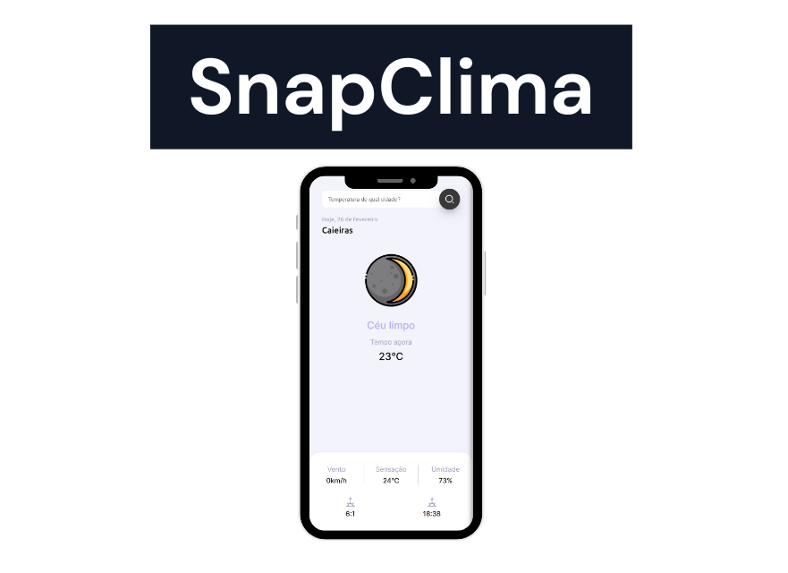

# SnapClima ⛅

O SnapClima é uma aplicação onde você consegue ver a previsão do tempo de qualquer cidade do mundo.

O projeto foi criado para evoluir meus conhecimentos em JavaScript e aprender como consome uma API.

## 🛠️ Tecnologias

- JavaScript
- HTML
- CSS
## 💙 Contato

joaoliveira.batista1@gmail.com
